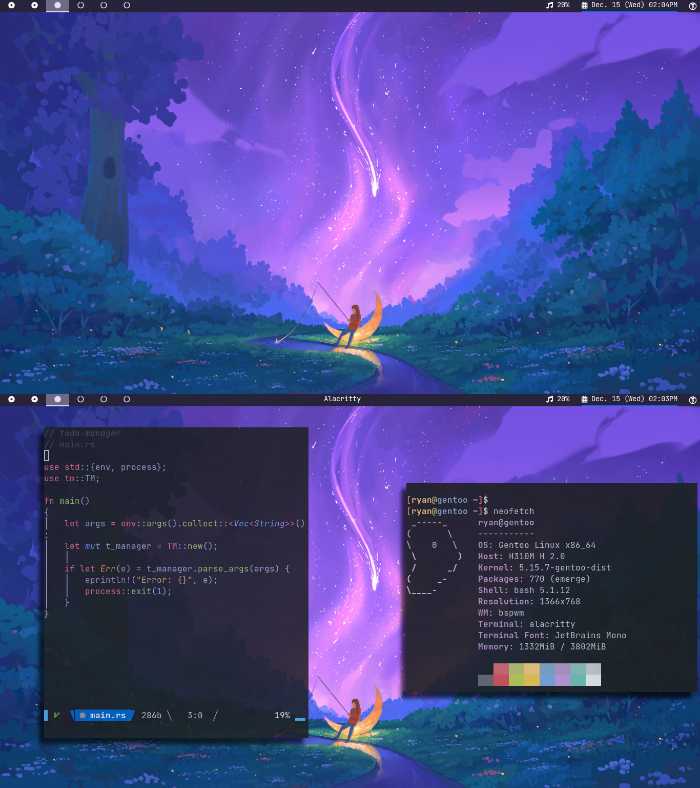

# README

These are my dotfiles. Currently using Artix Linux.

---

## Programs
| Needs | Program Used |
|-------|--------------|
|application launcher|rofi|
|bittorrent client|qbittorrent|
|browser|qutebrowser|
|file manager|ranger|
|image viewer|imv|
|music player|cmus|
|notification|dunst|
|password manager|bitwarden|
|pdf viewer|zathura|
|screenshots|scrot|
|terminal emulator|alacritty|
|video player|mpv|
|window manager|bspwm|

## Fonts Needed
- Iosevka
- Font Awesome
